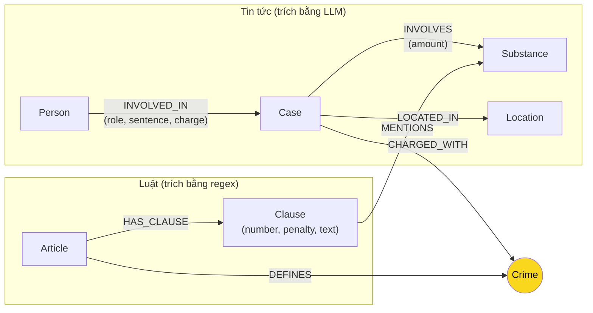

# Thiết kế Ontology — Day 19

**Họ tên:** Trần Anh Đăng  **MSSV:** 2A202602992

**Lựa chọn** (đánh dấu một):
- [x] Dùng ontology gợi ý (có thể chỉnh nhỏ)
- [ ] Tự thiết kế (xét bonus +15, xem `SUBMISSION.md`)

> Hướng dẫn: `LAB_GUIDE.md` Bước 2. Dùng ontology gợi ý thì vẫn phải điền đủ các mục dưới đây bằng lời của bạn.

## 1. Sơ đồ

## 2. Entity types (node labels)

| Label | Ý nghĩa | Khóa định danh (`MERGE` theo) | Properties | Lấy từ KB nào | Trích bằng (regex / LLM / khác) |
| --- | --- | --- | --- | --- | --- |
| `Article` | Điều luật trong BLHS | `id` ("Điều 251 BLHS") | `title`, `law`, `doc_id` | Luật (`drug_law`) | Regex |
| `Clause` | Khoản của một Điều luật | `id` ("Điều 251 BLHS khoản 1") | `number`, `penalty`, `text`, `doc_id` | Luật (`drug_law`) | Regex |
| `Crime` | Tội danh chuẩn hóa (node cầu nối) | `name` ("mua bán trái phép chất ma túy") | `name` | Cả hai | Regex (Luật) + LLM & `link_entity` (Tin) |
| `Case` | Vụ án / Vụ việc ma túy | `name` ("Vụ mua bán 36kg ma túy...") | `summary`, `date`, `doc_id`, `source_title` | Tin tức (`drug_news`) | LLM |
| `Person` | Người liên quan (bị cáo, bị can...) | `name` | `aliases` | Tin tức (`drug_news`) | LLM |
| `Substance` | Chất ma túy | `name` ("Heroine", "MDMA"...) | `name` | Cả hai | Match từ danh sách (Luật) + LLM (Tin) |
| `Location` | Tỉnh/thành phố nơi diễn ra vụ án | `name` | `name` | Tin tức (`drug_news`) | LLM |

## 3. Relationships

| Type | Từ → Đến | Properties trên cạnh | Ý nghĩa |
| --- | --- | --- | --- |
| `DEFINES` | `Article` → `Crime` | Không có | Điều luật quy định / định nghĩa tội danh này |
| `HAS_CLAUSE` | `Article` → `Clause` | Không có | Điều luật gồm các khoản hình phạt |
| `MENTIONS` | `Clause` → `Substance` | Không có | Khoản luật đề cập/quy định chất ma túy này |
| `CHARGED_WITH` | `Case` → `Crime` | Không có | Vụ án liên quan đến tội danh cụ thể |
| `INVOLVES` | `Case` → `Substance` | `amount` | Vụ án có sự xuất hiện của chất ma túy và khối lượng |
| `LOCATED_IN` | `Case` → `Location` | Không có | Vụ án xảy ra tại địa bàn / tỉnh thành |
| `INVOLVED_IN` | `Person` → `Case` | `role`, `sentence`, `charge` | Đương sự tham gia vụ án với vai trò, mức án và tội danh cá nhân |

## 4. Node cầu nối giữa 2 KB

- **Node nào:** `Crime` (Tội danh).
- **Vì sao chọn node này:** Văn bản Luật quy định Điều luật theo từng "Tội ..." (`Article` - DEFINES -> `Crime`), trong khi Tin tức báo chí phản ánh các vụ án/người bị truy tố, xét xử về các tội danh tương ứng (`Case` - CHARGED_WITH -> `Crime`). `Crime` là điểm chung duy nhất tồn tại mang tính pháp lý trong cả 2 nguồn tri thức.
- **Cách đảm bảo hai phía khớp tên:** 
  1. Phía Luật: Tách tên tội từ tiêu đề Điều luật bằng Regex, bỏ tiền tố "Tội " và chuyển thành chữ thường chuẩn hóa (`normalize_crime`).
  2. Phía Tin tức: Đưa danh sách các tội danh chuẩn vào LLM Prompt. Đồng thời sử dụng hàm `link_entity()` để xử lý khớp mờ (chữ hoa/thường, biến thể chính tả tiếng Việt như *tuý/túy*) thông qua `difflib.get_close_matches(cutoff=0.8)` về tên chuẩn.
- **Khi nào cầu gãy, và bạn xử lý thế nào:** 
  * Cầu gãy khi bài báo dùng tên tội danh lạ, viết tắt hoặc trích xuất LLM không khớp với danh sách luật.
  * Xử lý: `link_entity()` sẽ trả về `None` nếu độ tương đồng dưới 0.8 thay vì nối bừa. Phía RAG Agent vẫn sử dụng kết quả Vector Search (Flat RAG chunks) song song với dữ kiện từ Graph để không bị mất thông tin.

## 5. Competency questions

| Câu | Đường đi (Cypher pattern) | Trả lời được? |
| --- | --- | --- |
| Q1 | `(:Article {id: "..."})-[:HAS_CLAUSE]->(:Clause)` | Trả lời được (đơn hop từ KB Luật) |
| Q2 | `(:Person)-[:INVOLVED_IN]->(k:Case {name: "..."})` | Trả lời được (đơn hop từ KB Tin tức) |
| Q3 | `(:Person {name:'Lê Minh Thành'})-[:INVOLVED_IN]->(:Case)-[:CHARGED_WITH]->(:Crime)<-[:DEFINES]-(:Article)-[:HAS_CLAUSE]->(:Clause)` | Trả lời được (Cross-KB nối Người → Vụ → Tội → Điều luật → Khoản 1) |
| Q4 | `(:Person)-[:INVOLVED_IN]->(:Case)-[:CHARGED_WITH]->(:Crime)<-[:DEFINES]-(:Article)-[:HAS_CLAUSE]->(:Clause)` | Trả lời được (Cross-KB từ biệt danh 'Hoàng Nato' → Person → Case → Crime → Article → Khoản cao nhất) |
| Q5 | `(:Person {name:'Cái Quang Huy'})-[:INVOLVED_IN]->(k:Case)-[:INVOLVES]->(s:Substance {name:'MDMA'})` + `(k)-[:CHARGED_WITH]->(:Crime)<-[:DEFINES]-(a:Article)-[:HAS_CLAUSE]->(cl:Clause)-[:MENTIONS]->(s)` | Trả lời được (Cross-KB multi-hop khớp cả Substance giữa Vụ và Khoản luật) |
| Q6 | `MATCH (k:Case)-[:INVOLVES]->(:Substance {name:'MDMA'}) OPTIONAL MATCH (p:Person)-[:INVOLVED_IN]->(k) RETURN k, p` | Trả lời được (Aggregation tập hợp mọi vụ án liên quan đến MDMA) |

## 6. Quyết định thiết kế và đánh đổi

1. **Dùng Regex cho KB Luật thay vì LLM:**
   * *Đã chọn:* Trích xuất `Article`, `Clause`, `Substance` từ KB Luật bằng Regex và danh sách từ khóa cố định.
   * *Phương án khác:* Dùng LLM trích xuất toàn bộ.
   * *Vì sao chọn:* Văn bản luật có cấu trúc rất đều đặn (Điều x, khoản y), Regex cho tốc độ tức thì, chi phí = 0 USD, độ chính xác 100% không lo hallucination.
2. **Tách tới mức độ `Clause` (Khoản) thay vì dừng ở `Article` (Điều):**
   * *Đã chọn:* Mô hình hóa mỗi Khoản luật thành một Node `Clause` riêng.
   * *Phương án khác:* Chỉ tạo Node `Article` và lưu toàn bộ văn bản điều luật dưới dạng thuộc tính.
   * *Vì sao chọn:* Khung hình phạt (như tù 2-7 năm vs tù chung thân/tử hình) nằm ở từng Khoản cụ thể. Tách Node `Clause` cho phép Cypher truy vấn chính xác khoản phù hợp với khối lượng ma túy hoặc hành vi, giảm token đưa vào LLM Prompt.
3. **Sử dụng `Crime` làm Node đại diện độc lập (Canonical Node):**
   * *Đã chọn:* Tạo Node `Crime` duy nhất cho mỗi tội danh và dùng `MERGE` để các `Case` và `Article` cùng trỏ về.
   * *Phương án khác:* Lưu tội danh như một chuỗi thuộc tính (string property) trên `Case` hoặc `Article`.
   * *Vì sao chọn:* Tạo Node `Crime` riêng giúp thực hiện truy vấn đồ thị multi-hop xuyên qua 2 cơ sở dữ liệu cực kỳ nhanh chóng và tự nhiên (`MATCH (Case)-[:CHARGED_WITH]->(Crime)<-[:DEFINES]-(Article)`).

## 7. So với ontology gợi ý (bắt buộc nếu xét bonus)

*(Không áp dụng do lựa chọn Dùng ontology gợi ý)*

| Điểm khác | Gợi ý làm gì | Bạn làm gì | Vấn đề nó giải quyết | Bằng chứng (Cypher, hoặc số liệu benchmark) |
| --- | --- | --- | --- | --- |
| N/A | N/A | N/A | N/A | N/A |

## 8. Hạn chế còn lại

1. **Khóa của `Case` và `Person` phụ thuộc vào tên do LLM tự đặt:** Nếu 2 bài báo viết về cùng một người hoặc cùng một vụ án với tên hơi khác nhau, hệ thống sẽ tạo ra 2 Node tách biệt thay vì gộp lại.
2. **Chưa tự động phân tích ngưỡng khối lượng bằng Cypher:** Việc đối chiếu khối lượng tang vật trong tin tức (ví dụ: 9.6kg MDMA) với ngưỡng định khung trong khoản luật hiện phụ thuộc một phần vào việc prompt cung cấp các Khoản liên quan để LLM chọn lựa.
3. **Biến thể tên chất ma túy:** Nếu tin tức dùng tên thương mại hoặc tên lóng chưa có trong danh sách `SUBSTANCES` chuẩn, hệ thống có thể chưa tạo liên kết `MENTIONS` chính xác.
